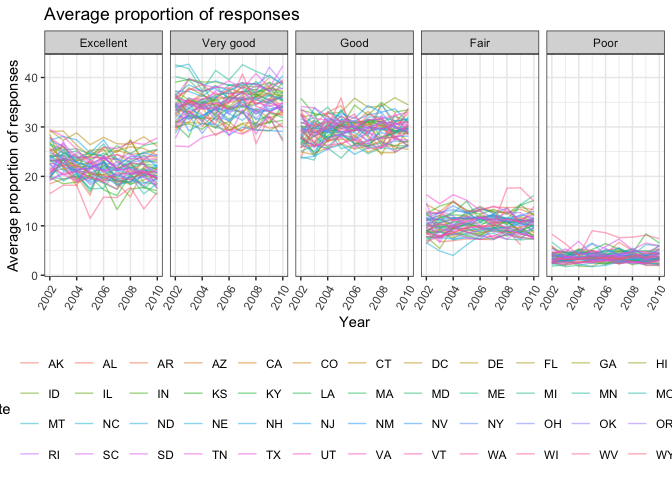

p8105\_hw3\_amv2187
================
Alyssa Vanderbeek (amv2187)
15 October 2018

Problem 1
---------

``` r
data("brfss_smart2010") 

brfss_cleaned = brfss_smart2010 %>%
  janitor::clean_names() %>%
  filter(topic == 'Overall Health' & response %in% c('Excellent', 'Very good', 'Good', 'Fair', 'Poor')) %>%
  mutate(response = factor(response, ordered = TRUE, levels = c('Excellent', 'Very good', 'Good', 'Fair', 'Poor'))) %>%
  rename(state = locationabbr,
         county = locationdesc)

str(brfss_cleaned)
```

    ## Classes 'tbl_df', 'tbl' and 'data.frame':    10625 obs. of  23 variables:
    ##  $ year                      : int  2010 2010 2010 2010 2010 2010 2010 2010 2010 2010 ...
    ##  $ state                     : chr  "AL" "AL" "AL" "AL" ...
    ##  $ county                    : chr  "AL - Jefferson County" "AL - Jefferson County" "AL - Jefferson County" "AL - Jefferson County" ...
    ##  $ class                     : chr  "Health Status" "Health Status" "Health Status" "Health Status" ...
    ##  $ topic                     : chr  "Overall Health" "Overall Health" "Overall Health" "Overall Health" ...
    ##  $ question                  : chr  "How is your general health?" "How is your general health?" "How is your general health?" "How is your general health?" ...
    ##  $ response                  : Ord.factor w/ 5 levels "Excellent"<"Very good"<..: 1 2 3 4 5 1 2 3 4 5 ...
    ##  $ sample_size               : int  94 148 208 107 45 91 177 224 120 66 ...
    ##  $ data_value                : num  18.9 30 33.1 12.5 5.5 15.6 31.3 31.2 15.5 6.4 ...
    ##  $ confidence_limit_low      : num  14.1 24.9 28.2 9.5 3.5 11 26 26.1 11.7 4.4 ...
    ##  $ confidence_limit_high     : num  23.6 35 38 15.4 7.4 20.1 36.5 36.2 19.2 8.3 ...
    ##  $ display_order             : int  1 2 3 4 5 1 2 3 4 5 ...
    ##  $ data_value_unit           : chr  "%" "%" "%" "%" ...
    ##  $ data_value_type           : chr  "Crude Prevalence" "Crude Prevalence" "Crude Prevalence" "Crude Prevalence" ...
    ##  $ data_value_footnote_symbol: chr  NA NA NA NA ...
    ##  $ data_value_footnote       : chr  NA NA NA NA ...
    ##  $ data_source               : chr  "BRFSS" "BRFSS" "BRFSS" "BRFSS" ...
    ##  $ class_id                  : chr  "CLASS08" "CLASS08" "CLASS08" "CLASS08" ...
    ##  $ topic_id                  : chr  "Topic41" "Topic41" "Topic41" "Topic41" ...
    ##  $ location_id               : chr  NA NA NA NA ...
    ##  $ question_id               : chr  "GENHLTH" "GENHLTH" "GENHLTH" "GENHLTH" ...
    ##  $ respid                    : chr  "RESP056" "RESP057" "RESP058" "RESP059" ...
    ##  $ geo_location              : chr  "(33.518601, -86.814688)" "(33.518601, -86.814688)" "(33.518601, -86.814688)" "(33.518601, -86.814688)" ...

``` r
# Which states were observed at 7 locations in 2002?
brfss_cleaned %>%
  filter(year == 2002) %>%  # filter to only listings in 2002
  distinct(state, county) %>%  # select distinct state and county variables
  group_by(state) %>% # get distinct locations
  filter(n() == 7) %>%  # state listings that have exactly 7 counties listed
  distinct(state) # get states
```

    ## # A tibble: 3 x 1
    ## # Groups:   state [3]
    ##   state
    ##   <chr>
    ## 1 CT   
    ## 2 FL   
    ## 3 NC

``` r
# Make a “spaghetti plot” that shows the number of locations in each state from 2002 to 2010.
brfss_cleaned %>%
  distinct(state, county, year) %>%
  count(state, year) %>%
  ggplot(aes(x = year, y = n, color = state)) +
  geom_line(alpha = 0.6) + 
  labs(
    title = 'Number of counties that responded 2002-2010',
    y = 'Number of counties',
    x = 'Year', 
    fill = 'x'
  ) +
  theme(legend.position = 'right')
```


``` r
  # geom_smooth(method = 'loess', se = F, alpha = 0.5)


# Make a table showing, for the years 2002, 2006, and 2010, the mean and standard deviation of the proportion of “Excellent” responses across locations in NY State.
brfss_cleaned %>%
  filter(year %in% c(2002, 2006, 2010) & 
         response == 'Excellent' & 
         state == 'NY') %>% 
  group_by(year) %>%
  summarise(Average = mean(data_value), 
            'Std Dev' = sd(data_value)) %>%
  knitr::kable(caption = 'Proportion of "Excellent" responses in NY state' )
```

|  year|   Average|   Std Dev|
|-----:|---------:|---------:|
|  2002|  24.04000|  4.486424|
|  2006|  22.53333|  4.000833|
|  2010|  22.70000|  3.567212|

``` r
# For each year and state, compute the average proportion in each response category (taking the average across locations in a state). Make a five-panel plot that shows, for each response category separately, the distribution of these state-level averages over time.
brfss_cleaned %>% 
  group_by(year, state, response) %>%
  summarise(avg = mean(data_value, na.rm = T)) %>% 
  ggplot(aes(x = year, y = avg, color = state)) +
  geom_line(alpha = 0.5) +
  facet_grid(~response) + 
  labs(
    title = 'Average proportion of responses',
    y = 'Average proportion of responses',
    x = 'Year'
  ) + 
  theme(axis.text.x = element_text(angle = 60, hjust = 1)) +
  guides(colour = guide_legend(nrow = 4, byrow = T)) 
```



Problem 2
---------

``` r
data("instacart")
```

Problem 3
---------

``` r
data("ny_noaa")
```
