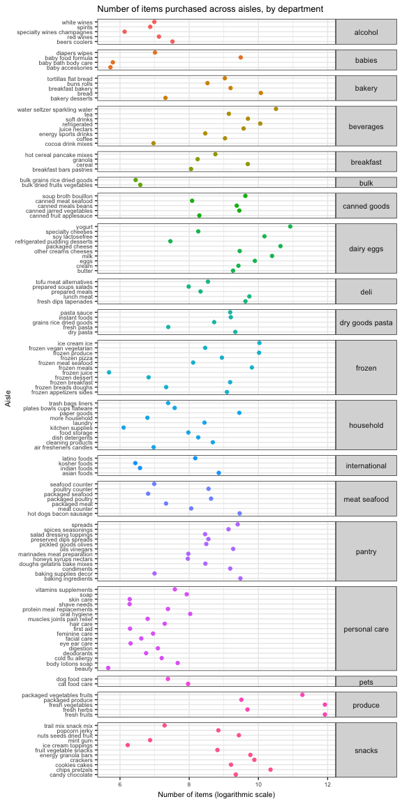

p8105\_hw3\_amv2187
================
Alyssa Vanderbeek (amv2187)
15 October 2018

Problem 1
---------

``` r
data("brfss_smart2010") 

brfss_cleaned = brfss_smart2010 %>%
  janitor::clean_names() %>%
  filter(topic == 'Overall Health' & response %in% c('Excellent', 'Very good', 'Good', 'Fair', 'Poor')) %>%
  mutate(response = factor(response, ordered = TRUE, levels = c('Excellent', 'Very good', 'Good', 'Fair', 'Poor'))) %>%
  rename(state = locationabbr,
         county = locationdesc)

str(brfss_cleaned)
```

    ## Classes 'tbl_df', 'tbl' and 'data.frame':    10625 obs. of  23 variables:
    ##  $ year                      : int  2010 2010 2010 2010 2010 2010 2010 2010 2010 2010 ...
    ##  $ state                     : chr  "AL" "AL" "AL" "AL" ...
    ##  $ county                    : chr  "AL - Jefferson County" "AL - Jefferson County" "AL - Jefferson County" "AL - Jefferson County" ...
    ##  $ class                     : chr  "Health Status" "Health Status" "Health Status" "Health Status" ...
    ##  $ topic                     : chr  "Overall Health" "Overall Health" "Overall Health" "Overall Health" ...
    ##  $ question                  : chr  "How is your general health?" "How is your general health?" "How is your general health?" "How is your general health?" ...
    ##  $ response                  : Ord.factor w/ 5 levels "Excellent"<"Very good"<..: 1 2 3 4 5 1 2 3 4 5 ...
    ##  $ sample_size               : int  94 148 208 107 45 91 177 224 120 66 ...
    ##  $ data_value                : num  18.9 30 33.1 12.5 5.5 15.6 31.3 31.2 15.5 6.4 ...
    ##  $ confidence_limit_low      : num  14.1 24.9 28.2 9.5 3.5 11 26 26.1 11.7 4.4 ...
    ##  $ confidence_limit_high     : num  23.6 35 38 15.4 7.4 20.1 36.5 36.2 19.2 8.3 ...
    ##  $ display_order             : int  1 2 3 4 5 1 2 3 4 5 ...
    ##  $ data_value_unit           : chr  "%" "%" "%" "%" ...
    ##  $ data_value_type           : chr  "Crude Prevalence" "Crude Prevalence" "Crude Prevalence" "Crude Prevalence" ...
    ##  $ data_value_footnote_symbol: chr  NA NA NA NA ...
    ##  $ data_value_footnote       : chr  NA NA NA NA ...
    ##  $ data_source               : chr  "BRFSS" "BRFSS" "BRFSS" "BRFSS" ...
    ##  $ class_id                  : chr  "CLASS08" "CLASS08" "CLASS08" "CLASS08" ...
    ##  $ topic_id                  : chr  "Topic41" "Topic41" "Topic41" "Topic41" ...
    ##  $ location_id               : chr  NA NA NA NA ...
    ##  $ question_id               : chr  "GENHLTH" "GENHLTH" "GENHLTH" "GENHLTH" ...
    ##  $ respid                    : chr  "RESP056" "RESP057" "RESP058" "RESP059" ...
    ##  $ geo_location              : chr  "(33.518601, -86.814688)" "(33.518601, -86.814688)" "(33.518601, -86.814688)" "(33.518601, -86.814688)" ...

``` r
# Which states were observed at 7 locations in 2002?
brfss_cleaned %>%
  filter(year == 2002) %>%  # filter to only listings in 2002
  distinct(state, county) %>%  # select distinct state and county variables
  group_by(state) %>% # get distinct locations
  filter(n() == 7) %>%  # state listings that have exactly 7 counties listed
  distinct(state) # get states
```

    ## # A tibble: 3 x 1
    ## # Groups:   state [3]
    ##   state
    ##   <chr>
    ## 1 CT   
    ## 2 FL   
    ## 3 NC

``` r
# Make a “spaghetti plot” that shows the number of locations in each state from 2002 to 2010.
brfss_cleaned %>%
  distinct(state, county, year) %>%
  count(state, year) %>%
  ggplot(aes(x = year, y = n, color = state)) +
  geom_line(alpha = 0.6) + 
  labs(
    title = 'Number of counties that responded 2002-2010',
    y = 'Number of counties',
    x = 'Year', 
    fill = 'x'
  ) +
  theme(legend.position = 'right')
```


``` r
  # geom_smooth(method = 'loess', se = F, alpha = 0.5)


# Make a table showing, for the years 2002, 2006, and 2010, the mean and standard deviation of the proportion of “Excellent” responses across locations in NY State.
brfss_cleaned %>%
  filter(year %in% c(2002, 2006, 2010) & 
         response == 'Excellent' & 
         state == 'NY') %>% 
  group_by(year) %>%
  summarise(Average = mean(data_value), 
            'Std Dev' = sd(data_value)) %>%
  knitr::kable(caption = 'Proportion of "Excellent" responses in NY state' )
```

|  year|   Average|   Std Dev|
|-----:|---------:|---------:|
|  2002|  24.04000|  4.486424|
|  2006|  22.53333|  4.000833|
|  2010|  22.70000|  3.567212|

``` r
# For each year and state, compute the average proportion in each response category (taking the average across locations in a state). Make a five-panel plot that shows, for each response category separately, the distribution of these state-level averages over time.
brfss_cleaned %>% 
  group_by(year, state, response) %>%
  summarise(avg = mean(data_value, na.rm = T)) %>% 
  ggplot(aes(x = year, y = avg, color = state)) +
  geom_line(alpha = 0.5) +
  facet_grid(~response) + 
  labs(
    title = 'Average proportion of responses',
    y = 'Average proportion of responses',
    x = 'Year'
  ) + 
  theme(axis.text.x = element_text(angle = 60, hjust = 1),
        legend.position = "bottom") +
  guides(colour = guide_legend(nrow = 4, byrow = T)) 
```


Problem 2
---------

``` r
data("instacart")
```

What are the average/median/maximum number of items purchased by people? On what day(s) of the week are the most items purchased? The least? What types of food are purchased most often? Is there an association between the number of items a person purchased and the number of prior visits they've made? Is there a pattern that is commonly followed in the store? (i.e. an association between a product's aisle and order of addition to cart) At what time of day do most orders take place?

``` r
aisles = instacart %>%
  group_by(aisle, department) %>%
  count %>%
  arrange(department, n)

aisles %>% filter(n == max(.$n))
```

    ## # A tibble: 1 x 3
    ## # Groups:   aisle, department [1]
    ##   aisle            department      n
    ##   <chr>            <chr>       <int>
    ## 1 fresh vegetables produce    150609

``` r
aisles %>%
  filter(!(aisle %in% c('missing', 'other'))) %>%
  ggplot(aes(y = aisle, x = log(n), color = department)) +
  geom_point() +
  facet_grid(department ~ ., scales = 'free', space = 'free') + # facet by department
  labs( # set labels
    title = 'Number of items purchased across aisles, by department',
    x = 'Number of items (logarithmic scale)',
    y = 'Aisle'
  ) +
  theme(text = element_text(size = 8), # make text small enough to be non-overlapping
        legend.position = 'none', # no legend (not necessary with facet_grid)
        strip.text.y = element_text(size = 8, angle = 0)) # make face_grid titles horizontal so they are legible
```



``` r
instacart %>%
  filter(aisle %in% c('baking ingredients', 'dog food care', 'packaged vegetables fruits')) %>%
  group_by(aisle, product_name) %>%
  count %>%
  arrange(aisle, n) %>%
  group_by(aisle) %>%
  slice(n()) %>%
  knitr::kable()
```

| aisle                      | product\_name                                 |     n|
|:---------------------------|:----------------------------------------------|-----:|
| baking ingredients         | Light Brown Sugar                             |   499|
| dog food care              | Snack Sticks Chicken & Rice Recipe Dog Treats |    30|
| packaged vegetables fruits | Organic Baby Spinach                          |  9784|

``` r
instacart %>%
  filter(product_name %in% c('Pink Lady Apples', 'Coffee Ice Cream')) %>%
  group_by(order_dow) %>%
  rename('Day of the week' = order_dow) %>%
  summarise('Average hour of purchase' = round(mean(order_hour_of_day))) %>%
  knitr::kable(caption = 'Average time of purchase of Pink Lady apples and coffee ice cream')
```

|  Day of the week|  Average hour of purchase|
|----------------:|-------------------------:|
|                0|                        14|
|                1|                        12|
|                2|                        13|
|                3|                        15|
|                4|                        13|
|                5|                        13|
|                6|                        13|

Problem 3
---------

``` r
data("ny_noaa")

ny_noaa_cleaned = 
  ny_noaa %>%
  mutate(year = as.numeric(format(date, '%Y')), # split date into three columns (year, month, day)
         month = month.abb[as.numeric(format(date, '%m'))],
         day = as.numeric(format(date, '%d')),
         #ny_noaa[, 3:5] <- apply(ny_noaa[, 3:5], MARGIN = 2, function(i){ i/10 }))
         prcp = prcp/10/10, # convert measurements to cm 
         snow = snow/10,
         snwd = snwd/10,
         tmax = as.numeric(tmax)/10, # convert temperature to degrees Celsius
         tmin = as.numeric(tmin)/10)

ny_noaa_cleaned %>%
  filter(month %in% c('Jan', 'Jul')) %>%
  group_by(id, month, year) %>%
  summarise(avg_tmax = mean(tmax, na.rm = T)) %>%
  ggplot(aes(x = year, y = avg_tmax, color = id)) +
  geom_line() +
  facet_grid(.~month) +
  labs( # set labels
    title = 'Average maximum temperature',
    x = 'Year',
    y = 'Temperature (Celsius)'
  ) +
  viridis::scale_color_viridis(
    name = 'Weather station',
    discrete = T
  ) +
  theme(axis.text.x = element_text(angle = 60, hjust = 1),
        legend.position = 'none') # no legend (not necessary with facet_grid)
```


