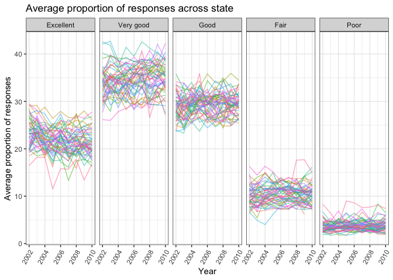
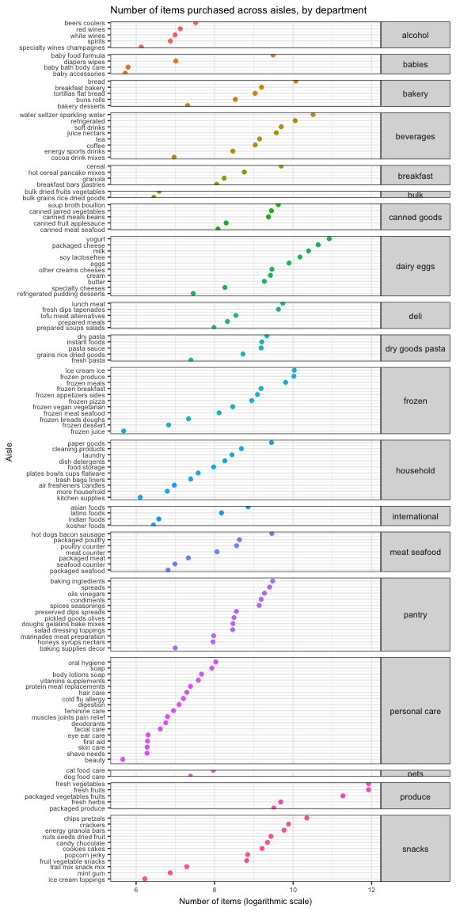
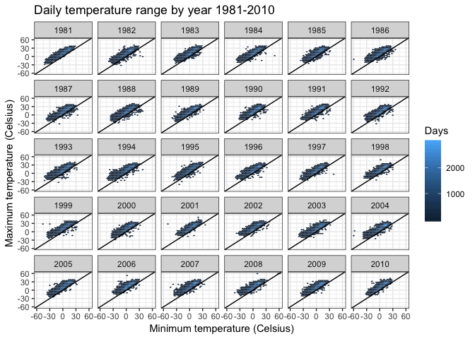

p8105\_hw3\_amv2187
================
Alyssa Vanderbeek (amv2187)
15 October 2018

Problem 1
---------

``` r
data("brfss_smart2010") 

brfss_cleaned = brfss_smart2010 %>%
  janitor::clean_names() %>%
  filter(topic == 'Overall Health' & response %in% c('Excellent', 'Very good', 'Good', 'Fair', 'Poor')) %>%
  mutate(response = factor(response, ordered = TRUE, levels = c('Excellent', 'Very good', 'Good', 'Fair', 'Poor'))) %>%
  rename(state = locationabbr,
         county = locationdesc)

str(brfss_cleaned)
```

    ## Classes 'tbl_df', 'tbl' and 'data.frame':    10625 obs. of  23 variables:
    ##  $ year                      : int  2010 2010 2010 2010 2010 2010 2010 2010 2010 2010 ...
    ##  $ state                     : chr  "AL" "AL" "AL" "AL" ...
    ##  $ county                    : chr  "AL - Jefferson County" "AL - Jefferson County" "AL - Jefferson County" "AL - Jefferson County" ...
    ##  $ class                     : chr  "Health Status" "Health Status" "Health Status" "Health Status" ...
    ##  $ topic                     : chr  "Overall Health" "Overall Health" "Overall Health" "Overall Health" ...
    ##  $ question                  : chr  "How is your general health?" "How is your general health?" "How is your general health?" "How is your general health?" ...
    ##  $ response                  : Ord.factor w/ 5 levels "Excellent"<"Very good"<..: 1 2 3 4 5 1 2 3 4 5 ...
    ##  $ sample_size               : int  94 148 208 107 45 91 177 224 120 66 ...
    ##  $ data_value                : num  18.9 30 33.1 12.5 5.5 15.6 31.3 31.2 15.5 6.4 ...
    ##  $ confidence_limit_low      : num  14.1 24.9 28.2 9.5 3.5 11 26 26.1 11.7 4.4 ...
    ##  $ confidence_limit_high     : num  23.6 35 38 15.4 7.4 20.1 36.5 36.2 19.2 8.3 ...
    ##  $ display_order             : int  1 2 3 4 5 1 2 3 4 5 ...
    ##  $ data_value_unit           : chr  "%" "%" "%" "%" ...
    ##  $ data_value_type           : chr  "Crude Prevalence" "Crude Prevalence" "Crude Prevalence" "Crude Prevalence" ...
    ##  $ data_value_footnote_symbol: chr  NA NA NA NA ...
    ##  $ data_value_footnote       : chr  NA NA NA NA ...
    ##  $ data_source               : chr  "BRFSS" "BRFSS" "BRFSS" "BRFSS" ...
    ##  $ class_id                  : chr  "CLASS08" "CLASS08" "CLASS08" "CLASS08" ...
    ##  $ topic_id                  : chr  "Topic41" "Topic41" "Topic41" "Topic41" ...
    ##  $ location_id               : chr  NA NA NA NA ...
    ##  $ question_id               : chr  "GENHLTH" "GENHLTH" "GENHLTH" "GENHLTH" ...
    ##  $ respid                    : chr  "RESP056" "RESP057" "RESP058" "RESP059" ...
    ##  $ geo_location              : chr  "(33.518601, -86.814688)" "(33.518601, -86.814688)" "(33.518601, -86.814688)" "(33.518601, -86.814688)" ...

``` r
# Which states were observed at 7 locations in 2002?
brfss_cleaned %>%
  filter(year == 2002) %>%  # filter to only listings in 2002
  distinct(state, county) %>%  # select distinct state and county variables
  group_by(state) %>% # get distinct locations
  filter(n() == 7) %>%  # state listings that have exactly 7 counties listed
  distinct(state) # get states
```

    ## # A tibble: 3 x 1
    ## # Groups:   state [3]
    ##   state
    ##   <chr>
    ## 1 CT   
    ## 2 FL   
    ## 3 NC

According to the data, Connecticut, Florida, and North Carolina were observed at exactly 7 locations.

``` r
# Make a “spaghetti plot” that shows the number of locations in each state from 2002 to 2010.
brfss_cleaned %>%
  distinct(state, county, year) %>%
  count(state, year) %>%
  ggplot(aes(x = year, y = n, color = state)) +
  geom_line(alpha = 0.6) + 
  labs(
    title = 'Number of counties that responded 2002-2010',
    y = 'Number of counties',
    x = 'Year', 
    fill = 'x'
  ) +
  theme(legend.position = 'right')
```


``` r
  # geom_smooth(method = 'loess', se = F, alpha = 0.5)
```

The above plot shows that most states have less than 10 responding counties in any given year, with a few exceptions. The most counties to respond in one year was 44 in Florida in 2007.

``` r
# Make a table showing, for the years 2002, 2006, and 2010, the mean and standard deviation of the proportion of “Excellent” responses across locations in NY State.
brfss_cleaned %>%
  filter(year %in% c(2002, 2006, 2010) & 
         response == 'Excellent' & 
         state == 'NY') %>% 
  group_by(year) %>%
  summarise('Average proportion of "Excellent" responses' = mean(data_value), 
            'Standard Dev' = sd(data_value)) %>%
  knitr::kable(caption = 'Proportion of "Excellent" responses in NY state' )
```

|  year|  Average proportion of "Excellent" responses|  Standard Dev|
|-----:|--------------------------------------------:|-------------:|
|  2002|                                     24.04000|      4.486424|
|  2006|                                     22.53333|      4.000833|
|  2010|                                     22.70000|      3.567212|

The average proportion of "Excellent" responses in NY state is pretty similar in 2002, 2006, and 2010, at approximately 23%. The highest proportion of "Excellent" responses occurred in 2002, but it came also with the biggest variation in responses.

``` r
# For each year and state, compute the average proportion in each response category (taking the average across locations in a state). Make a five-panel plot that shows, for each response category separately, the distribution of these state-level averages over time.
brfss_cleaned %>% 
  group_by(year, state, response) %>%
  summarise(avg = mean(data_value, na.rm = T)) %>% 
  ggplot(aes(x = year, y = avg, color = state)) +
  geom_line(alpha = 0.5) +
  facet_grid(~response) + 
  labs(
    title = 'Average proportion of responses across state',
    y = 'Average proportion of responses',
    x = 'Year'
  ) + 
  theme(axis.text.x = element_text(angle = 60, hjust = 1),
        legend.position = "none") 
```



From the figure, it's clear that most counties respond with "Very Good" over the years, followed by "Good", "Excellent", "Fair", and "Poor". No discernible trends exist; the average proportion of counties that respond any particular way is consistent between 2002-2010.

Problem 2
---------

``` r
data("instacart")
```

The data in the 'instacart' dataset are compiled from online grocery orders via participating food stores. Each row corresponds to one purchased item, many of which can make up one order (one-to-many table). The dataset is large, with 1384617 rows (items ordered) and 15 variables. Some notable variables include the item ordered ('product\_name') and order number. There's also information about when the order was made, including the day of the week and hour of the day. There's also information about the aisle from which a product was ordered, but these aisles may not be entirely distinct. For example, there is a 'packaged produce' aisle, as well as a 'packaged vegetables and fruits' aisle. It's unclear what distinguishes these two things, but it may be explained by the fact that the dataset is a composite of multiple grocery stores, between which there may be discrepancies in aisle names and/or how data is reported.

The data has potential to answer many questions, including but not limited to:

What are the average/median/maximum number of items purchased by people?
On what day(s) of the week are the most items purchased? The least?
What types of food are purchased most often?
Is there an association between the number of items a person purchased and the number of prior visits they've made?
Is there a pattern that is commonly followed in the store? (i.e. an association between a product's aisle and order of addition to cart)
At what time of day do most orders take place?

``` r
aisles = instacart %>%
  group_by(aisle, department) %>%
  count %>% # count number of items sold in each aisle
  ungroup %>%
  arrange(department, n) %>% # arrange by department and number of items ordered
  mutate(order = row_number()) # add sort column

aisles %>% filter(n == max(.$n))
```

    ## # A tibble: 1 x 4
    ##   aisle            department      n order
    ##   <chr>            <chr>       <int> <int>
    ## 1 fresh vegetables produce    150609   123

There are 134 aisles in the dataset. The most items are ordered from the produce aisles (fresh and packaged vegetables and fruits).

``` r
aisles %>%
  filter(!(aisle %in% c('missing', 'other'))) %>% # filter uncategorized columns
  ggplot(aes(y = order, x = log(n), color = department)) +
  geom_point() +
  facet_grid(department ~ ., scales = 'free', space = 'free') + # facet by department
  scale_y_continuous( # sort aisles by number of items ordered within each department
    breaks = aisles$order,
    labels = aisles$aisle
  ) +
  labs( # set labels
    title = 'Number of items purchased across aisles, by department',
    x = 'Number of items (logarithmic scale)',
    y = 'Aisle'
  ) +
  theme(text = element_text(size = 8), # make text small enough to be non-overlapping
        legend.position = 'none', # no legend (not necessary with facet_grid)
        strip.text.y = element_text(size = 8, angle = 0)) # make face_grid titles horizontal so they are legible
```



The above plot shows the total number of items purchased in each aisle, grouped by department. Number of items was transformed to a logarithmic scale to accomodate the large range of quantities (287, 150609). Produce was the most ordered items, with quantities in the 100,000+ range. I assume this to mean that orders were counted either by individual produce, or by weight (e.g. lbs, oz). Beauty products were the least ordered item.

``` r
instacart %>%
  filter(aisle %in% c('baking ingredients', 'dog food care', 'packaged vegetables fruits')) %>%
  group_by(aisle, product_name) %>%
  count %>% 
  arrange(aisle, n) %>%
  group_by(aisle) %>% 
  slice(n()) %>%
  left_join(., aisles[, c('aisle', 'n')], by = 'aisle') %>%
  rename('Aisle' = aisle,
         'Product' = product_name,
         'Quantity' = n.x,
         'Total items ordered in aisle' = n.y) %>%
  knitr::kable()
```

| Aisle                      | Product                                       |  Quantity|  Total items ordered in aisle|
|:---------------------------|:----------------------------------------------|---------:|-----------------------------:|
| baking ingredients         | Light Brown Sugar                             |       499|                         13088|
| dog food care              | Snack Sticks Chicken & Rice Recipe Dog Treats |        30|                          1612|
| packaged vegetables fruits | Organic Baby Spinach                          |      9784|                         78493|

The most-ordered item was light brown sugar in the baking ingedients aisle; Snack Sticks Chicken and Rice Dog Treats in the dog food and care aisle; and organic baby spinach in the packaged fruits and vegetables aisles. Packaged baby spinach accounts for over 12% of the total number of items ordered from the package vegetables and fruits aisle, while the dog food and brown sugar make up a much smaller portion of the total items sold.

``` r
instacart %>%
  filter(product_name %in% c('Pink Lady Apples', 'Coffee Ice Cream')) %>%
  group_by(product_name, order_dow) %>%
  rename('Day of the week' = order_dow,
         ' ' = product_name) %>%
  summarise('Average hour of purchase' = (round(mean(order_hour_of_day)))) %>%
  spread('Day of the week', 'Average hour of purchase') %>%
  knitr::kable(caption = 'Average time of purchase of Pink Lady apples and coffee ice cream')
```

|                  |    0|    1|    2|    3|    4|    5|    6|
|------------------|----:|----:|----:|----:|----:|----:|----:|
| Coffee Ice Cream |   14|   14|   15|   15|   15|   12|   14|
| Pink Lady Apples |   13|   11|   12|   14|   12|   13|   12|

In general, it seems that pink lady apples are purchased earlier in the day than coffee ice cream by a couple of hours.

Problem 3
---------

``` r
data("ny_noaa")

ny_noaa_cleaned = 
  ny_noaa %>%
  mutate(year = as.numeric(format(date, '%Y')), # split date into three columns (year, month, day)
         month = month.name[as.numeric(format(date, '%m'))],
         day = as.numeric(format(date, '%d')),
         #ny_noaa[, 3:5] <- apply(ny_noaa[, 3:5], MARGIN = 2, function(i){ i/10 }))
         prcp = prcp/10/10, # convert measurements to cm 
         snow = snow/10,
         snwd = snwd/10,
         tmax = as.numeric(tmax)/10, # convert temperature to degrees Celsius
         tmin = as.numeric(tmin)/10)

apply(ny_noaa_cleaned[, 3:7], FUN = summary, MARGIN = 2)[7, ] / nrow(ny_noaa_cleaned) # proportion of rows that are NA for each variable
```

    ##      prcp      snow      snwd      tmax      tmin 
    ## 0.0561958 0.1468960 0.2280331 0.4371025 0.4371264

``` r
# check to see what trends exist for missing temperature data
ny_noaa_cleaned %>%
  filter(is.na(tmin)) %>%
  group_by(id) %>%
  count %>%
  arrange(desc(n))
```

    ## # A tibble: 728 x 2
    ## # Groups:   id [728]
    ##    id              n
    ##    <chr>       <int>
    ##  1 USC00304772 10957
    ##  2 USC00306196 10957
    ##  3 USC00309425 10957
    ##  4 USC00303851 10926
    ##  5 USC00306745 10926
    ##  6 USC00301580 10896
    ##  7 USC00303983 10896
    ##  8 USC00305679 10870
    ##  9 USC00301265 10866
    ## 10 USC00305925 10866
    ## # ... with 718 more rows

The NOAA data contains weather information for a given day across many different weather stations. Data in the dataset is specific to New York weather stations between 1981 and 2010. Specifically, we have information about the amount of precipitation, snowfall, snow accumulation, and the maximum and minimum temperatures in any given day. It's a large dataset, with 2595176 entries across 747 stations over 30 years. There is a fair amount of missing data, mostly for the temperature variables - nearly half (43.7%) of entries are missing information about the daily temperature range. The number of missing entries appears to vary quite a bit by station, with some stations missing only 1 day, and others without any data; for example, station USC00304772 doesn't have any temperature data over the 30-year period.

``` r
ny_noaa_cleaned %>%
  filter(month %in% c('January', 'July')) %>%
  group_by(id, month, year) %>%
  summarise(avg_tmax = mean(tmax, na.rm = T)) %>%
  ggplot(aes(x = year, y = avg_tmax, color = id)) +
  geom_line() +
  #geom_smooth(method = 'lm', color = 'black', size = 0.5) +
  facet_grid(month~.) +
  labs( # set labels
    title = 'Average maximum temperature',
    x = 'Year',
    y = 'Temperature (Celsius)'
  ) +
  viridis::scale_color_viridis(
    name = 'Weather station',
    discrete = T
  ) +
  theme(axis.text.x = element_text(angle = 60, hjust = 1),
        legend.position = 'none') # no legend (not necessary with facet_grid)
```


The above figure represents the average maximum temperature across all stations in January and July each year from 1981-2010. While there are no obvious trends over time (the average maximum temperature in January 1981 and January 2010 are comparable), there does appear to be an oscillatory pattern. Temperature will climb and fall again, and this pattern repeats over time. It's also worth noting that this pattern lines up across months, that is, a warmer January corresopnds with a warmer July. But the magnitude of the temperature change from previous years is not necessarily reflected. There seems to be a larger range of maximum temperatures in January of any given year than in July, and the trends over time vary to a larger extend as well.

``` r
max_v_min = 
  ggplot(ny_noaa_cleaned, aes(x = tmin, y = tmax)) +
    geom_hex() +
    geom_abline(slope = 1, intercept = 0) +
    scale_y_continuous(limits = c(-60, 60)) + # set y-axis range to match x-axis range
    labs( # set labels
      title = '(a) Daily temperature 1981-2010',
      x = 'Minimum temperature (Celsius)',
      y = 'Maximum temperature (Celsius)'
    ) + 
    theme(legend.position = c(1, 0),
          legend.justification = c(1.1, -0.1),
          legend.background = element_rect(color = "black", size = 0.2, linetype = "solid"),
          legend.key.size = unit(0.02, "npc")) +
    scale_fill_continuous(guide = guide_colorbar(title = 'Days'))
  

temp_by_year = 
  ny_noaa_cleaned %>%
  filter(snow > 0 & snow < 100) %>%
  group_by(year) %>%
  ggplot(aes(x = year, y = snow, group = year)) +
  geom_boxplot(fill = 'grey') + 
  coord_flip() + 
  labs(
    title = '(b) Snowfall amount by year',
    y = 'Snowfall (cm)',
    x = 'Year'
  )

max_v_min + temp_by_year
```


In plot (a) above, we can see that in general, the average minimum temperature is fairly close to the average maximum temperature (the relationship has a positive correlation). There are some outliers where the minimum temperature is notably lower than the maximum. Conversely, there appears to be many values (1183) where the maximum temperature is puportedly lower than the minimum temperature (values to the right of the diagonal line.

In plot (b), we see that the average snowfall is close to zero. This makes sense given that the plot includes measures across all months including summer, which also explains the high number of apparent outliers.

Below are visuals of time-specific trends in average daily temperature range, by year and by month.

``` r
# Plot showing temperature ranges by year
ggplot(ny_noaa_cleaned, aes(x = tmin, y = tmax)) +
  geom_hex() +
  geom_abline(slope = 1, intercept = 0) +
  scale_y_continuous(limits = c(-60, 60)) + # set y-axis range to match x-axis range
  facet_wrap(.~year) +
  labs( # set labels
      title = 'Daily temperature range by year 1981-2010',
      x = 'Minimum temperature (Celsius)',
      y = 'Maximum temperature (Celsius)'
  ) + 
  scale_fill_continuous(guide = guide_colorbar(title = 'Days'))
```



``` r
# Temperature range by month of the year, across all years
ny_noaa_cleaned %>%
  mutate(month = factor(month, levels = month.name)) %>% # relevel month column to render in order
  ggplot(aes(x = tmin, y = tmax)) +
  geom_hex() +
  geom_abline(slope = 1, intercept = 0) +
  scale_y_continuous(limits = c(-60, 60)) + # set y-axis range to match x-axis range
  facet_wrap(.~month) +
  labs( # set labels
      title = 'Daily temperature range by month',
      x = 'Minimum temperature (Celsius)',
      y = 'Maximum temperature (Celsius)'
  ) + 
  scale_fill_continuous(guide = guide_colorbar(title = 'Days'))
```


According to the figures, the trends within any given year don't vary much over time. However, we can see that daily temperature varies more in winter months than it does in the summer months.
